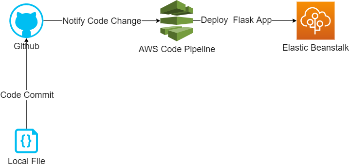
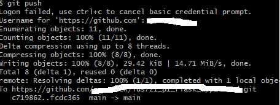
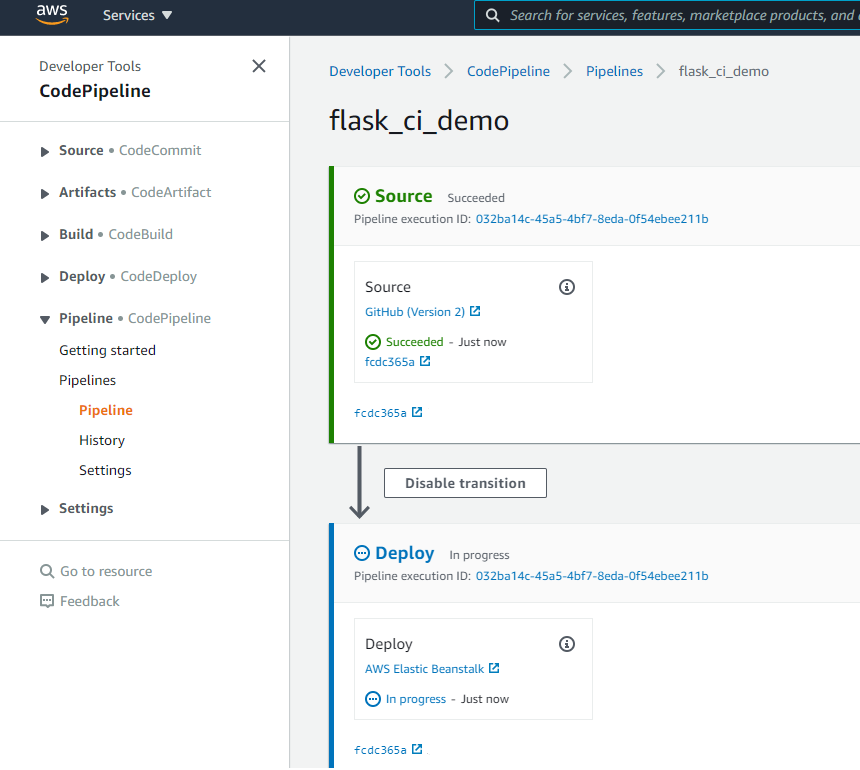
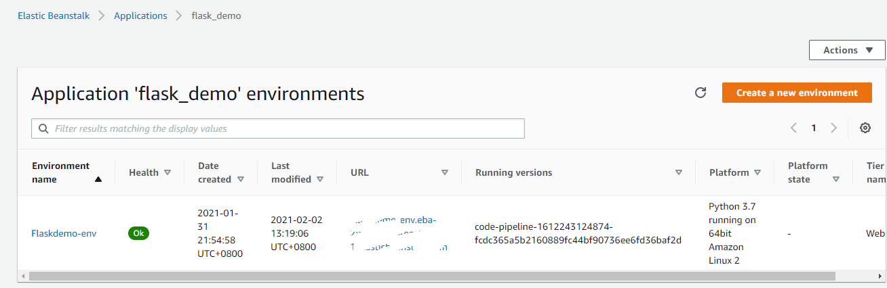
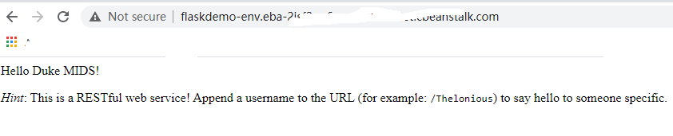

# Continuous Delivery of Flask Application on AWS EBS

In this article, I will explain how to implement Continuous Delivery (CD) pipeline on GitHub and AWS.  For this propose, I use a toy python Flask Application as a demo project. The project's code is hosted using a GitHub repository . The Flask Application is deployed on AWS Elastic Beanstalk. Aside from that, AWS Code pipeline is used to trigger a deploy process automatically when there is a new commit to the GitHub repository. 

## AWS Elastic Beanstalk 

With AWS Elastic Beanstalk (EBS) we can quickly deploy and manage applications in the AWS Cloud without having to learn about the infrastructure that runs those applications. Elastic Beanstalk reduces management complexity without restricting choice or control. 

In this demo, Elastic Beanstalk will handle all details of provisioning, instance allocations, public access and application health monitoring. What I need to do for deploying my Flask application is only uploading my code to EBS. 

## Flask Application on EBS

Flask is an open source web application framework for Python.  It enable us to setup a web application  quickly. In this demo, we use Flask to build a toy application.  Here is a step-by-step tutorial about [how to deploy a Flask Application on EBS](https://docs.aws.amazon.com/elasticbeanstalk/latest/dg/create-deploy-python-flask.html).  Here, I want to mention that there are something should be notice while using Flaks with EBS 

1. The global variable for flask application **MUST** be "application"

2. The main file **MUST** be named **`application.py`**

3. The file recording required python packages **MUST** be named **`requirements.txt`**

## AWS Code Pipeline
AWS Code Pipeline is a fully managed continuous delivery service that helps us automate our release pipelines for fast and reliable application and infrastructure updates. Code Pipeline automates the build, test, and deploy phases of our release process every time there is a code change. This enables us to rapidly and reliably deliver features and updates. 

In this demo AWS Code Pipeline plays a critical role to trigger a new deployment once there is a code update. 

## Follow Chart 

Here is the follow chart of this demo, it is very straightforward and contains these steps:

1. A local code changed was committed to GitHub repository.
2. GitHub notify Code Pipeline that its target repository has a new modification. 
3. AWS Code Pipeline download code from GitHub repository  and deploy it to Elastic Beanstalk.
4. Elastic Beanstalk update Flask Application.

##  Demonstration 

####  Push  Code Change

#### AWS Code Pipeline Deploy New Application

#### Elastic Beanstalk Finish Deployment

#### Web Page Updated

